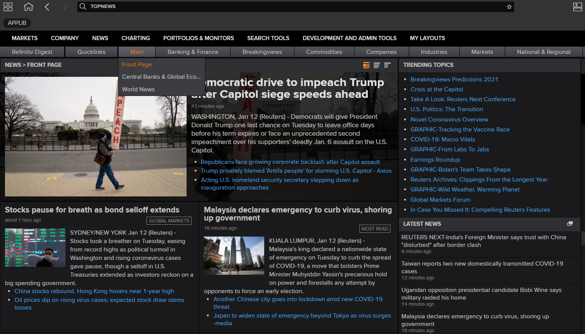
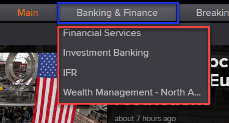
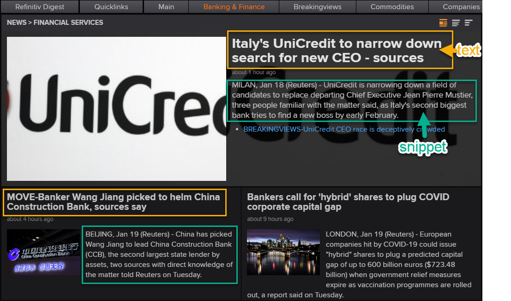
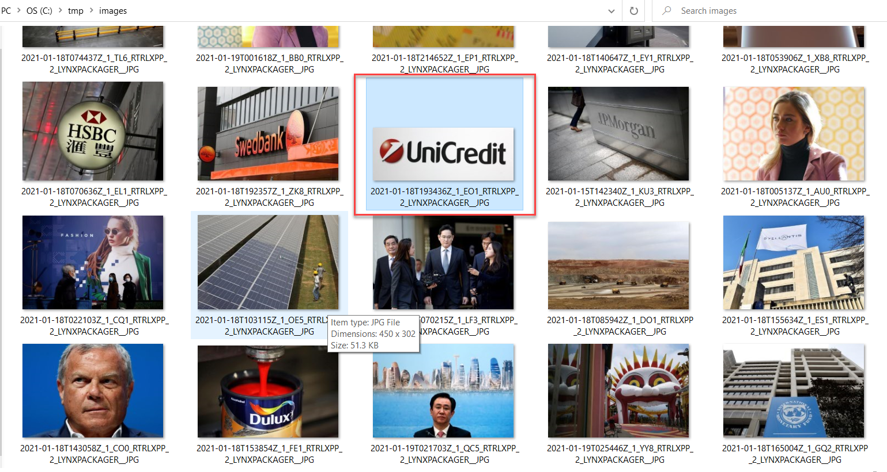

# How to retrieve RDP Top News using RDP Library for .NET

## Introduction

[Refinitiv Data Platform (RDP)](https://www.refinitiv.com/en/products/refinitiv-data-platform#overview) provides simple web-based API access to a broad range of content. News service is one of the popular services provided on the platform. One of the important News sources on RDP is Reuters News. Reuters has 2600 journalists in nearly 200 locations delivering international and national news with speed and insight. It delivers more than 2.2 million News Stories per year in 16 languages, actively covering 41,000 companies. The Reuters news and third-party news is available via the News service on standard REST-based APIs.The service basically provides operations to query news content such as news headlines, stories, and get Top News, etc. It also provides another operation to retrieve related content and metadata.  You can find more details and a list of services available on the News service from
[RDP News Service User and Design Guide](https://my.refinitiv.com/content/dam/myrefinitiv/products/11528/en/UserGuides/604929.pdf). RDP users can explore the [API Playground](https://apidocs.refinitiv.com/Apps/ApiDocs), which provides access to the RDP News APIs via a Graphical User Interface(GUI).

In this article, we will talk about the Top News operation. The operation basically returns a hierarchy of top news packages in JSON format. The user can parse the JSON message to get a list of pages containing its name and top news id. The user can then use the top news id for each page to retrieve a list of top news headlines along with story id and image id associated with the headline.  A developer can use the data returns from this operation to build the Top News application like the Refinitiv Workspace app. The following screenshot is a sample Top News page from the Refinitiv Workspace.



To demonstrate the REST API usages we will utilize the RDP Library for .NET to create a sample application. The application will call the Top News endpoint to retrieve a Top News packages' hierarchy along with the list of headlines provided under the specific Top News package. We will combine the other operations with the Top News operation to retrieve a story and images from the News services.

## Prerequisite

* Please read [Getting Started with .NET Guide](https://developers.refinitiv.com/en/api-catalog/refinitiv-data-platform/refinitiv-data-platform-libraries/quick-start#getting-started-with-net) for the basic steps to set up the library and create a Session to login to the RDP server. We will not explain the basic usages in this article.

* Installed [.NET Core SDK 3.1 or .NET 5.0](https://dotnet.microsoft.com/download).

* Visual Studio 2019 or [Visual Studio Code](https://code.visualstudio.com/).

* Valid RDP account with permission to retrieve data from RDP News service. You can find more details about RDP credentials from the following [Guide](https://developers.refinitiv.com/en/api-catalog/refinitiv-data-platform/refinitiv-data-platform-libraries/quick-start#access-credentials).

## Top News interfaces and data structure

Referring to [APIDocs page](https://apidocs.refinitiv.com/Apps/ApiDocs), the RDP News service has been provided under /data/news/{version} and the current version at the time we write this article is v1.

Below is the full base URI for the News APIs.

```url
https://api.refinitiv.com/data/news/v1/
```

We will use the following interfaces to create the sample application and demonstrate the use case.

|  PATH                 |Operation |Description                                                       |
|-----------------------|----------|------------------------------------------------------------------|
|/top-news              | GET      |Retrieves the top news packages hierarchy.                        |
|/top-news/{topNewsId}  | GET      |Retrieves the top news headlines package based on the topNewsId   |
|/stories/{storyId}     | GET      |Retrieves a Story content based on the storyId.                   |
|/images/{imageid}      | GET      |Retrieves an image based on the imageid.                          |

You can find the description for each operation in detail in the next section.

### Top News operation

The full path for this operation

```URL
https://api.refinitiv.com/data/news/v1/top-news
```

No input is required for the operation. The response will be the hierarchy of top news packages in JSON format. The response message contains a hierarchy of top news package lowest level contains a package or page name and its topNewsId. You can pass the value of topNewsId to Headlines operation to get a list of relevant headlines.

Example of response:

```json
{
    "data": [
        {
            "name": "Main",
            "pages": [
                {
                    "name": "Front Page",
                    "topNewsId": "urn:newsml:reuters.com:20020923:SPDOC_119827232002"
                },
                {
                    "name": "Central Banks & Global Economy",
                    "topNewsId": "urn:newsml:reuters.com:20080317:SPDOC_1727041720081"
                }
            ]
        },
        {
            "name": "Breakingviews",
            "pages": [
                {
                    "name": "Reuters Breakingviews",
                    "topNewsId": "urn:newsml:reuters.com:20090126:SPDOC_1343432620091"
                }
            ]
        }
    ]
}
```

### Top News Headlines operation

This operation can be used to get top news headlines. Package ID or TopNews Id is required.

The full path for this operation is as follows:

```URL
https://api.refinitiv.com/data/news/v1/top-news/{topNewsId}
```

The response data contains a list of headlines text with associated storyId, which you can pass to a story operation to retrieve a full news story. It also provides an id and the smallId under the image section. The application can pass to image operation to retrieve photos or thumbnail photos related to the headline.

Below is a sample response message :

```json
{
    "data": [
        {
            "text": "Soccer-Trophies more important for Man United than top four -
   Solskjaer",
            "dateLine": "Jan 29 (Reuters)",
            "snippet": "Manchester United caretaker manager Ole Gunnar Solskjaer said he
   will not be satisfied.",
            "image": {
                "byLine": "HANNAH MCKAY",
                "text": "A file photo of Manchester United interim manager.",
                "smallId": "2019-01-29T082009Z_1_CW0_RTRLXPP_1_LYNXPACKAGER.JPG",
                "id": "2019-01-29T082009Z_1_CW0_RTRLXPP_2_LYNXPACKAGER.JPG"
            },
            "versionCreated": "2019-01-29T05:23:00.000Z",
            "storyId": "urn:newsml:reuters.com:20190129:nL5N1ZT0GG",
            "relatedHeadlines": [
                {
                    "text": "Soccer-Chelsea to face Manchester United in FA Cup fifth round",
                    "versionCreated": "2019-01-28T19:50:00.000Z",
                    "dateLine": "Jan 28 (Reuters)",
                    "snippet": "Holders Chelsea have been drawn to face Manchester United.",
                    "webUrl": "",
                    "documentType": "Story",
                    "storyId": "urn:newsml:reuters.com:20190128:nL5N1ZS63V"
                }
            ]
        },
    ...
    ]
}
```

### Stories operation

This operation was designed to get the news story by specific full story identifier (storyId)

• storyId: full story identifier (for example: "urn:newsml:reuters.com:20180227:nNRA6cw73t:1")

The full path for this operation

```URL
https://api.refinitiv.com/data/news/v1/stories/{story id}
```

The story can be retrieved in JSON or HTML format.
To select the story format, 2 options are available:

• accept header:
o text/html
o application/json

• extension
o json
o html

The extension has a higher priority than the header. It means that if, for example, the accept header equals "text/html", but story ID is sent as sampleStory.json, the result will be in JSON format.

You can find additional details about the stories operation from [RDP News Service User and Design Guide](https://my.refinitiv.com/content/dam/myrefinitiv/products/11528/en/UserGuides/604929.pdf). We also have [article](https://developers.refinitiv.com/en/article-catalog/article/build-news-headlines-mobile-app-using-flutter-and-rdp-part1)  that provides a sample mobile app to retrieve the news story using the stories operation.

### Images operation

Basically, the stories that are part of a Top News or an Online Report package may have an image associated. It will be presented in the form of an identifier you can use in the /images/{id} endpoint.
The full path for this operation is as follows:

```URL
https://api.refinitiv.com/data/news/v1/images/{images id}
```

You can retrieve an image either as a raw binary or as a JSON RSF document. When loading as a raw binary, you can also create a thumbnail for the image.

#### Basic usage

The only mandatory field is the image identifier.
Depending on the source of the image, Online Report, or Top News package, the format will be slightly different.

The image id field will then be part of the URL path:

```URL
/images/{images id}
```

For instance, with image id: 58c94894-f0c9-49ca-80c9-69b9bd099f7f the resolved path is:

```URL
/images/58c94894-f0c9-49ca-80c9-69b9bd099f7f
```

#### Supported output formats

You can switch between the raw image representation and a JSON RSF output using the accept header.
There are two possible values:

• image/jpeg - the default, provides the raw image output

• application/json - provides the image in a JSON RSF format, which allows for additional metadata about the image to be retrieved

#### Thumbnail generation

When loading the image using the image/jpeg format, you can create a thumbnail on the fly using the height and width headers. If you specify only one of the two sizes, the services computed the other sizes to keep the image original ratio. When the two sizes are defined, and the ratio is changed, the image is stretched and cropped to fill the whole output.

Sample Usages to resized the Top News images

```URL
https://api.refinitiv.com/data/news/v1/images/2020-06-26T164302Z_1_YH8_RTRLXPP_2_LYNXPACKAGER__JPG?width=100&height=100
```

Basically, you can apply the concepts based on the above details to create your own Top News application. You can use any programming language or application which supports the REST API client library and the JSON parser to parse the content from the JSON response message. You can find additional details about the news service from the [Top News](https://apidocs.refinitiv.com/Apps/ApiDocs#/details/L2RhdGEvbmV3cy92MQ==/L3RvcC1uZXdz/GET/README) section on the API Doc page.


## Create Sample Top News Consumer app

We will create a simple .NET console application to demonstrate how to use RDP Library for .NET with the endpoint provided earlier to retrieve data and parse the Top News content from the JSON response message. There is no need to use the GUI and ASP.NET Web application framework in this project.

Please note that the console application will use the codes to create sessions from the article [Create MRN Real-Time News Story Consumer app using .NET Core and RDP.NET Library](https://developers.refinitiv.com/en/article-catalog/article/create-mrn-real-time-news-story-consumer-app-using-net-core-and-rdpnet-library) section "Create Session for Refinitiv Data Platform (RDP) or Refinitiv Real-Time – Optimized".

Once the session is open, we will use the session object with the Endpoint class(provided under Refinitiv.DataPlatform.Delivery.Request namespace) to retrieve the Top News content.

### Using Endpoint interface to request Top News packages

Currently, RDP Library for .NET does not provide an interface and data structure to retrieve Top News packages' hierarchy directly; therefore, we will instead use the Endpoint class provided by the RDP Library for .NET. It was designed for sending a request message and handle a response message based on the URI we pass to the function. Users don't need to handle an HTTP request header and manage the Access Token when using the Endpoint class.

Before we start using the Endpoint class, I will create a TopNewsPackage and TopNewsPackageData class that is the model and data structure to keep the top news package's hierarchy.

```csharp
 class TopNewsPackage
    {
        public string Name { get; set; }
        public IList<TopNewsPackageData> Pages { get; set; }
    }

 class TopNewsPackageData
    {
        public string Name { get; set; }
        public string RevisionId { get; set; }
        public string RevisionDate { get; set; }
        public string TopNewsId { get; set; }
    }
```

These classes were created based on the JSON message structure mentioned in the Top News operation section. Next step, I will show you the codes to use Endpoint to get data and deserialize it to TopNewsPackage class. Then the application can access the content from the TopNewsPackage object. We need to deserialize JSON messages under the "data" section of our class.

```csharp
  var topnewsPkgResp = Endpoint.SendRequestAsync(session, new Uri("https://api.refinitiv.com/data/news/v1/top-news")).GetAwaiter().GetResult();
  var data = topnewsPkgResp.Data.Raw["data"]?.ToObject<IList<TopNewsPackage>>();
```

We will print the top-level Package Name and the number of underlying pages to verify the codes.

```csharp
if (data != null)
{
    foreach (var package in data)
    {
        Console.WriteLine($"Package Name:{package.Name} Number of Pages: {package.Pages?.Count}");
        if (package.Pages.Any())
        {
            foreach (var subPackage in package.Pages)
            {
                Console.WriteLine($"\t\t{subPackage.Name} [{subPackage.TopNewsId}]");
            }
        }
    }
}
```

Below is the sample output. It will show the top-level Package name and number of sub-pages with its name and TopNewsId. We need to use the TopNewsId with the Headlines operation as described earlier.

```bash
Package Name:Main Number of Pages: 3
                Front Page [urn:newsml:reuters.com:20020923:SPDOC_119827232002]
                Central Banks & Global Economy [urn:newsml:reuters.com:20080317:SPDOC_1727041720081]
                World News [urn:newsml:reuters.com:20020924:SPDOC_56045242002]
Package Name:Breakingviews Number of Pages: 1
                Reuters Breakingviews [urn:newsml:reuters.com:20090126:SPDOC_1343432620091]
Package Name:Banking & Finance Number of Pages: 4
                Financial Services [urn:newsml:reuters.com:20030212:SPDOC_88894122003]
                Investment Banking [urn:newsml:reuters.com:20030324:SPDOC_46640242003]
                IFR [urn:newsml:reuters.com:20090214:SPDOC_714091420091]
                Wealth Management - North America [urn:newsml:reuters.com:20090513:SPDOC_1788511320091]
Package Name:Companies Number of Pages: 3
                U.S. Companies [urn:newsml:reuters.com:20020924:SPDOC_55977242002]
                European Companies [urn:newsml:reuters.com:20020924:SPDOC_55994242002]
                Asian Companies [urn:newsml:reuters.com:20020924:SPDOC_56007242002]
Package Name:Markets Number of Pages: 4
                Global Markets [urn:newsml:reuters.com:20171024:SPDOC_1420030242017]
                Foreign Exchange [urn:newsml:reuters.com:20030127:SPDOC_101094272003]
                Fixed Income [urn:newsml:reuters.com:20030127:SPDOC_99618272003]
                Emerging Markets [urn:newsml:reuters.com:20030915:SPDOC_39030152003]
Package Name:Commodities Number of Pages: 5
                Commodities [urn:newsml:reuters.com:20060119:SPDOC_28769192006]
                Energy [urn:newsml:reuters.com:20110214:SPDOC_1568591420111]
                Metals [urn:newsml:reuters.com:20110214:SPDOC_1568781420111]
                Agricultural Commodities [urn:newsml:reuters.com:20110214:SPDOC_1568921420111]
                Global Gas, Power & LNG [urn:newsml:reuters.com:20110214:SPDOC_1569211420111]
Package Name:Industries Number of Pages: 5
                Technology, Media & Telecoms [urn:newsml:reuters.com:20060725:SPDOC_304469252006]
                Industrials [urn:newsml:reuters.com:20030521:SPDOC_67969212003]
                Basic Materials [urn:newsml:reuters.com:20171024:SPDOC_1406550242017]
                Consumer Goods [urn:newsml:reuters.com:20030314:SPDOC_75442142003]
                Healthcare [urn:newsml:reuters.com:20030314:SPDOC_75426142003]
Package Name:National & Regional Number of Pages: 7
                Australia & New Zealand [urn:newsml:reuters.com:20150107:SPDOC_2847160072015]
                Greater China [urn:newsml:reuters.com:20080903:SPDOC_1276490320081]
                Britain & Ireland [urn:newsml:reuters.com:20080901:SPDOC_1365800120081]
                Canada [urn:newsml:reuters.com:20081001:SPDOC_1321850120081]
                Latin America [urn:newsml:reuters.com:20080903:SPDOC_1319880320081]
                Middle East & North Africa [urn:newsml:reuters.com:20080903:SPDOC_1308830320081]
                Africa [urn:newsml:reuters.com:20080813:SPDOC_2047711320081]
...
Package Name:Sports & Lifestyle Number of Pages: 2
                Sport [urn:newsml:reuters.com:20020927:SPDOC_66767272002]
                Lifestyle & Entertainment [urn:newsml:reuters.com:20070301:SPDOC_1688530120071]
Package Name:AWP Top News Number of Pages: 2
                AWP German Top News [urn:newsml:refinitiv.com:20200301:AWP_TN_DOC_2020030101]
                AWP French Top News [urn:newsml:refinitiv.com:20200301:AWP_TN_DOC_2020030102]

```

Let me compare the following result with the content on the Top News app on Refinitiv Workspace.

```bash
Package Name:Banking & Finance Number of Pages: 4
                Financial Services [urn:newsml:reuters.com:20030212:SPDOC_88894122003]
                Investment Banking [urn:newsml:reuters.com:20030324:SPDOC_46640242003]
                IFR [urn:newsml:reuters.com:20090214:SPDOC_714091420091]
                Wealth Management - North America [urn:newsml:reuters.com:20090513:SPDOC_1788511320091]
```

It looks similar to the list when you click Banking & Finance menu on the application. Below is a sample screenshot from Refinitiv Workspace.



### Retrieve Top News Headlines

We will use the TopNewsId from the previous step to retrieve the list of Top News Headlines for each page.

For example,

If we need the list of Top News Headlines for a Sport, we need to pass urn:newsml:reuters.com:20020927:SPDOC_66767272002 to TopNews headlines endpoint.

```url
https://api.refinitiv.com/data/news/v1/top-news/urn:newsml:reuters.com:20020927:SPDOC_66767272002
```

Anyway, based on the data structure from the sample JSON message for the Top News headline, I will create an additional class to caches the data like headline text or snippet with associated story id and image id. You can utilize the data structure in your GUI or web application to bind the application layer's data. And here is the class we create for the content in Top News Headline.

```csharp
class TopNewsData
    {
        public string text { get; set; }
        public string dateLine { get; set; }
        public string snippet { get; set; }
        public TopNewsImages image { get; set; }
        public string versionCreated { get; set; }
        public string storyId { get; set; }
        public  IList<HeadlineInfo> relatedHeadlines { get; set; }
    }

class TopNewsImages
    {
        public string byLine { get; set; }
        public string text { get; set; }
        public string smallId { get; set; }
        public string id { get; set; }
    }

class HeadlineInfo
    {
        public string text { get; set; }
        public string versionCreated { get; set; }
        public string dateLine { get; set; }
        public string snippet { get; set; }
        public string webUrl { get; set; }
        public string documentType { get; set; }
        public string storyId { get; set; }
    }
```

Like the Top News operation, we need to deserialize the JSON message under the "data" section to the TopNewsData object using the following codes.

```csharp
 var headlinesList = topNewsHeadlinesResp.Data.Raw["data"]?.ToObject<IList<TopNewsData>>();
if (headlinesList.Any())
{
    foreach (var topHeadline in headlinesList)
    {
        Console.WriteLine($"\t\t\t\t{topHeadline.text} storyId:[{topHeadline.storyId}] imageId:[{topHeadline.image?.id}]");
    }
}
```

Sample Output:

```bash
Package Name:Banking & Finance Number of Pages: 4
                Financial Services [urn:newsml:reuters.com:20030212:SPDOC_88894122003]
                                Italy's UniCredit to narrow down search for new CEO - sources storyId:[urn:newsml:reuters.com:20210119:nL1N2JT1MF] imageId:[2021-01-18T193436Z_1_EO1_RTRLXPP_2_LYNXPACKAGER__JPG]

                                MOVE-Banker Wang Jiang picked to helm China Construction Bank, sources say storyId:[urn:newsml:reuters.com:20210119:nL4N2JU0ZG] imageId:[2020-09-04T070741Z_936366842_RC2JRI95262W_RTRMADP_2_CHINA-TRADE-EXPO__JPG]

                                Bankers call for 'hybrid' shares to plug COVID corporate capital gap storyId:[urn:newsml:reuters.com:20210118:nL8N2JT2LU] imageId:[2021-01-11T001953Z_713338240_RC2C5L9A1ZQ8_RTRMADP_2_GERMANY-ECONOMY-GDP__JPG]

                                Swedbank proposes dividend of 4.35 SEK/share for 2019 storyId:[urn:newsml:reuters.com:20210118:nL8N2JT4D4] imageId:[2021-01-18T192357Z_1_ZK8_RTRLXPP_2_LYNXPACKAGER__JPG]

                                ANALYSIS-Ultra long bonds are back in force as rock-bottom rates create sweet spot storyId:[urn:newsml:reuters.com:20210118:nL8N2JT27Y] imageId:[]

                                Former Hong Kong lawmaker rejects HSBC explanation over frozen accounts storyId:[urn:newsml:reuters.com:20210118:nL1N2JT0DX] imageId:[2021-01-18T070636Z_1_EL1_RTRLXPP_2_LYNXPACKAGER__JPG]

                                EXCLUSIVE-Southeast Asia's Grab considering U.S. IPO this year, sources say storyId:[urn:newsml:reuters.com:20210118:nL1N2JT0HC] imageId:[2021-01-18T053906Z_1_XB8_RTRLXPP_2_LYNXPACKAGER__JPG]

                                Qatari bank sees gradual growth in Saudi after end of rift storyId:[urn:newsml:reuters.com:20210118:nL4N2JT2MX] imageId:[2021-01-18T140647Z_1_EY1_RTRLXPP_2_LYNXPACKAGER__JPG]

                Investment Banking [urn:newsml:reuters.com:20030324:SPDOC_46640242003]
                                Lonza to sell two capsule and softgel manufacturing sites to NextPharma storyId:[urn:newsml:reuters.com:20210119:nFWN2JT0VI] imageId:[2020-03-02T131137Z_899400255_RC2PBF9JNNXD_RTRMADP_2_SWISS-BUSINESS__JPG]
                                Couche-Tard CEO would love second shot at Carrefour deal storyId:[urn:newsml:reuters.com:20210118:nL1N2JT13W] imageId:[2021-01-13T171847Z_1980722673_RC257L9ZNSX4_RTRMADP_2_CARREFOUR-M-A-COUCHETARD__JPG]
    ...
```

Let compare the result with the screenshot from the Top News app again, you will see that the text property of the TopNewsData class is a text message in the yellow box from the screenshot, and the snippet property is a text message in the green box from the screenshot.



You can access other information from the TopNewsData object's properties rather than parsing the field from the JSON message. It is quite easy to bind the property from the TopNewsData class to the GUI on the WPF and Web application when you use the class.

### Get Headlines images and Story content.

Fortunately, RDP Library for .NET provides an interface to retrieve relevant news images and stories. So the user doesn't need to use the Endpoint class to retrieve the data and parse the content from the JSON message. It requires the storyId to retrieve the news story and the top news image id to get a photo associated with the headline.

#### Get news story using the RDP.NET interface

You can use the following snippet of codes to retrieve the news story. The class has IsSucess property you can use to verify if the operation is successful or a failure. If it's failed, a status returned from the server is shown in the console output.

```csharp
 var story = Story.Definition(topHeadline.storyId).GetData();

if (story.IsSuccess)
    Console.WriteLine($"\nStory: {story.Data.NewsStory}");
else
    Console.WriteLine($"Problem retrieving the story: {story.Status}");
```

Below is a sample output when passing storyId:[urn:newsml:reuters.com:20210118:nL4N2JQ1SR] to the snippet of codes.

```bash
Story:  (Adds statistics bureau official's comment on 2021 outlook in
16th paragraph)
    * China GDP up 6.5% y/y in Q4, vs Q3's 4.9% 
    * 2020 growth at 2.3%, lowest in more than four decades
    * Recovery seen gaining further steam in 2021 but risks
linger
    * Leaders rule out policy U-turn amid pandemic

    By Gabriel Crossley and Kevin Yao
    BEIJING, Jan 18 (Reuters) - China's economy picked up speed
in the fourth quarter, with growth beating expectations as it
ended a rough coronavirus-striken 2020 in remarkably good shape
and remained poised to expand further this year even as the
global pandemic rages unabated.
    Gross domestic product grew 2.3% in 2020, official data
showed on Monday, making China the only major economy in the
world to avoid a contraction last year as many nations struggled
to contain the COVID-19 pandemic. And China is expected to
continue to power ahead of its peers this year, with GDP set to
expand at the fastest pace in a decade at 8.4%, according to a
Reuters poll. [nL4N2JM0V0]
    The world's second-largest economy has surprised many with
the speed of its recovery from the coronavirus jolt, especially
as policymakers have also had to navigate tense U.S.-China
relations on trade and other fronts. 
   ...
    The central bank is poised to keep its benchmark lending
rate unchanged in coming months while steering a steady slowdown
in credit expansion in 2021, policy sources have said.
[nL1N2J22M4]
    The Chinese Academy of Social Sciences, a government think
tank, sees the macro leverage ratio jumping by about 30
percentage points in 2020 to over 270%.
    While this year's predicted growth rate of over 8% would be
the strongest in a decade, led by an expected double-digit
expansion in the first quarter, it is rendered less impressive
coming off the low base set in pandemic-stricken 2020.
    Some analysts also cautioned that a recent rebound in
COVID-19 cases in the northeast of the country could impact
activity and consumption in the run-up to next month's long
Lunar New Year holidays.[nL1N2JT017]
    "Control of people-flows has started, so the risk of a
widespread outbreak of Covid should be small," said Iris Pang,
ING's chief China economist.
    "But the risk of a technology war between China and some
economies remains if the U.S. does not remove some measures." 

 (Additional reporting by Stella Qiu;
Editing by Shri Navaratnam)
 ((Gabriel.Crossley@thomsonreuters.com; +86 10 5669 2127;))
```

When testing the same storyId with API Playground on the API Doc page, you will see the same content.


#### Get headline photo using RDP.NET interface

To retrieve the photo associated with the headline, you can use the following implementation. The application needs to pass the imageId to the Image interface, and the GetData method will return  IImageResponse, which is an interface for ImageResponse. Like the Story operation, there will be a status return when the operation is a failure.

```csharp
IImageResponse image = Image.Definition(topHeadline.image?.id).GetData();
if (image.IsSuccess)
{
    Console.WriteLine($"Image represented as a: {image.Data.Image} of length: {image.Data.Image.Length} bytes.");
}else
{
    Console.WriteLine($"Failed to retrieve image ID: {topHeadline.image?.id}\n{image.Status}");
}
```

Basically, the raw data return from the function is a byte array to write the byte array to the jpeg file directly. I will add sample codes to write the Image data to jpg file format under the directory "c:\tmp\images".

```csharp
IImageResponse image = Image.Definition(topHeadline.image?.id).Rendition("thumbnail").GetData();

if (image.IsSuccess)
{
    Console.WriteLine($"Image represented as a: {image.Data.Image} of length: {image.Data.Image.Length} bytes.");
    using var ms = new MemoryStream(image.Data.Image);
    using (var fs = new FileStream($"c:\\tmp\\images\\{topHeadline.image.id}.jpg", FileMode.Create))
    {
        ms.WriteTo(fs);
    }

}
```

Suppose we pass imageId:[2021-01-17T232321Z_544701600_RC2Z9L9AG8S2_RTRMADP_2_CHINA-ECONOMY-GDP__JPG] to the function we will get the following images under "c:\tmp\images".


This example provides an option for the console app to write the images that it can get from the server to a specific location. When you open the folder, you will see all photos with the same name as the image id under the folder "c:\tmp\images" such as the below sample screenshot.



The photo in the red box is an image for the following headline.

```bash
 Italy's UniCredit to narrow down search for new CEO - sources storyId:[urn:newsml:reuters.com:20210119:nL1N2JT1MF] imageId:[2021-01-18T193436Z_1_EO1_RTRLXPP_2_LYNXPACKAGER__JPG]
 ```

You can resize photos by setting the Rendition option to 'thumbnail' to create a thumbnail for your application or web page.

```csharp
IImageResponse image = Image.Definition(topHeadline.image?.id).Rendition("thumbnail").GetData();
```

## Demo Application

To test the sample application you can download the sample app from [Github](https://github.com/Refinitiv-API-Samples/Article.RDPLibrary.DotNet.TopNewsConsumer).

Then you can open the project file TopNewsConsumer.csproj on Visual Studio 2019 or open the project folder on Visual Studio Code.

Before running the app, you have to set your RDP Credential in the following section of Program.cs.

```csharp
  #region RDPCredential
        // Please set RDP Username, Password and AppKey here.
        static string UserName = "<RDP Username>";
        static string Password = "<RDP Password>";
        static string AppKey = "<RDP Appkey>";
  #endregion
```

You can also change the following parameters from false to true to let the application get the News Story and photo associated with the headlines. You can change images_save_path to a valid path on your pc, and the application must have permission to create files in the folder.

```csharp
// b_ShowNewStory set to true to get story associated with top news headline and print to console output
private static bool b_ShowNewsStory = false;

// b_SaveImagesToFile set to true to get photo associated with top news headline and save photo to images_save_path
private static bool b_SaveImagesToFile = false;

// Change path to a valid path on your pc
private static string images_save_path = @"c:\tmp\images\";

```

Then start the app using Debug=> Start Debugging or Start Without Debugging.
Or you can run the app using the __dotnet__ command under the same folder as the project file.

```bash
dotnet run
```

You will see the output like the following screen records.


## Summary

This article describes how to use RDP Library for .NET to retrieve the top news packages hierarchy and its child page. It also provides the sample codes and endpoint to retrieve the associated stories and retrieve a photo associated with the news headline. The customer can utilize these functions to create an application likes the Top News application on Refinitiv Workspace. They can design the application to cache pages and its topnewsId and then provide a way for users to navigate each page's content based on the TopNews name and its Id.

Though we provide the sample in .NET, you can use another programming language that provides a REST client library with the endpoint we provided in this article. Your application requires an additional implementation to manage the access token. It is required when you send an HTTP request to get data from the endpoints. RDP will return data in JSON format then you use the JSON parser library to parse specific content from the data.

## References

* [Refinitiv Data Platform Overview](https://www.refinitiv.com/en/products/refinitiv-data-platform#overview)
* [RDP News Service User and Design Guide](https://my.refinitiv.com/content/dam/myrefinitiv/products/11528/en/UserGuides/604929.pdf)
* [API Playground](https://apidocs.refinitiv.com/Apps/ApiDocs)
* [Getting Started with RDP.NET](https://developers.refinitiv.com/en/api-catalog/refinitiv-data-platform/refinitiv-data-platform-libraries/quick-start#getting-started-with-net)
* [Build News Headlines Mobile app using Flutter and RDP API (Part1)](https://developers.refinitiv.com/en/article-catalog/article/build-news-headlines-mobile-app-using-flutter-and-rdp-part1)